# Consultor Inteligente 

[](https://nodejs.org/)
[](https://www.python.org/)
[](LICENSE)

Um chatbot WhatsApp avançado que realiza consultas inteligentes em dados de produção industrial utilizando processamento de linguagem natural (NLP) e IA generativa.

## 🚀 Principais Funcionalidades

- **Consultas via Áudio/Texto**
  - Conversão automática OGG → WAV → Texto
  - Processamento de texto direto
  - Cache inteligente para transcrições
  
- **Análise de Dados Inteligente**
  - Geração automática de SQL via GPT-4
  - Humanização de respostas via GPT-4
  - Integração com banco SQLite em memória
  - Monitoramento em tempo real de dados CSV

- **Recursos Avançados**
  - Análise multidimensional de dados de produção
  - Suporte a consultas complexas via linguagem natural
  - Geração automática de gráficos e visualizações
  - Sistema de cache para otimização de performance

## 📋 Pré-requisitos

### Runtime & Linguagens
- Node.js ≥20.12.2
- Python ≥3.10.11

### Dependências Principais
```bash
# Core
whatsapp-web.js ^1.26.0   # Interface WhatsApp
openai         ^4.78.1    # Integração OpenAI (requer API Key)
better-sqlite3 ^11.8.0    # Banco de dados

# Processamento
fluent-ffmpeg  ^2.1.3     # Conversão de áudio
csv-parse      ^5.6.0     # Parsing CSV
node-cache     ^5.1.2     # Sistema de cache

# Utilitários
axios          ^1.7.8     # Requisições HTTP
dotenv         ^16.4.7    # Variáveis de ambiente
p-limit        ^6.1.0     # Controle de concorrência
```

## 🔧 Instalação & Configuração

1. **Instalação de Dependências**
   ```bash
   npm install
   ```

2. **Configuração do Ambiente**
   Crie um arquivo `.env` na raiz do projeto:
   ```env
   OPENAI_API_KEY=sua_chave_api
   FFMPEG_PATH=/caminho/do/ffmpeg
   ```

## ⚙️ Execução

1. **Iniciar o Serviço**
   ```bash
   node app.js
   ```

2. **Autenticação**
   - Escaneie o QR Code exibido via WhatsApp Web
   - Aguarde a confirmação de conexão
   - Comece a interagir via chat empresarial

## 🏗️ Arquitetura

### Componentes Core
| Componente | Tecnologia | Função |
|------------|------------|---------|
| Interface WhatsApp | whatsapp-web.js | Comunicação com usuários |
| Processamento de Áudio | Whisper + FFmpeg | Transcrição OGG→Texto |
| Geração de SQL | GPT-4 | Conversão NL→SQL |
| Banco de Dados | SQLite (in-memory) | Armazenamento temporário |
| Humanização | GPT-4 | Formatação natural de dados |

### Fluxo de Dados

```mermaid
sequenceDiagram
    Usuário->>+WhatsApp: Envia áudio/texto
    WhatsApp->>+Serviço: Processa mensagem
    Serviço->>+Whisper: Transcrição (se áudio)
    Whisper-->>-Serviço: Texto processado
    Serviço->>+GPT-4: Gera SQL
    GPT-4-->>-Serviço: Query otimizada
    Serviço->>+SQLite: Executa consulta
    SQLite-->>-Serviço: Dados brutos
    Serviço->>+GPT-4: Humaniza resposta
    GPT-4-->>-Serviço: Resposta formatada
    Serviço->>-Usuário: Envia via WhatsApp
```


## 🔒 Segurança & Performance

### Segurança
- Sanitização automática de queries SQL
- Restrição a operações SELECT
- Cache com TTL para transcrições
- Validação de entrada de dados

### Performance
- Cache em memória para consultas frequentes
- Limite de 5 requisições simultâneas
- Monitoramento de CSV a cada 5s
- Otimização automática de queries

## 🧪 Regras de Negócio

### Validações
- Assertividade em comandos SQL
- Formatação automática de datas (DD/MM/YYYY ↔ YYYY-MM-DD)
- Suporte a filtros temporais dinâmicos

### Processamento de Dados
- Conversão bidirecional de formatos de áudio
- Normalização de dados de entrada
- Transformação contextual de respostas

## 👥 Equipe

### Desenvolvimento e Arquitetura
- **João Pedro Pizoli Carvalho**
  Desenvolvedor de Software 


## 📄 Licença & Direitos

**Propriedade Exclusiva**
- Uso interno exclusivo
- Documentação sujeita a atualizações
- Todos os direitos reservados
